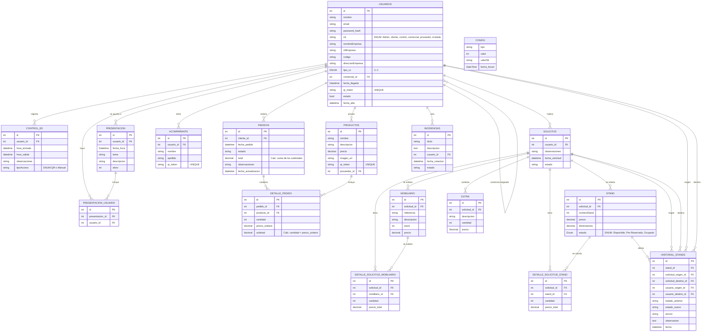

# Forum

## DIAGRAMA BASE DE DATOS

## JUSTIFICACIÓN TABLAS

- **Usuario**: Almacena a todas las personas que interactúan con la aplicación, independientemente del rol. Rol controla el acceso a cada sección, comercial_id auto-referencia a la misma tabla, un usuario con rol comercial se asigna a un usuario con rol cliente. Evitamos tabla intermedia innecesaria.

- **Control_es**: Registra los accesos mediante QR. El diseño de una única fila por visita (hora_entrada y hora_salida) mejor que dos filas separadas para entrada y salida. (Facilita calculo duración visita, permite detectar el doble escaneo). Almacenamos el tipo de acceso para diferenciarlo de un acceso manual o por escaneo de QR.

- **Presentacion**: Registra las "charlas" que se harán el dia del evento.

- **Presentacion_usuario**: Almacena el historial de personas que se "anotan" a la presentación.

- **Proveedores**: Tabla independiente para los proveedores del catálogo de productos. Permite filtrar el catálogo por proveedor de forma eficiente.

- **Productos** : El catálogo. Referencia a proveedores mediante proveedor_id.

- **Pedidos**: Cabecera del pedido. Contiene el total calculadoo, el estado (pendiente -> confirmado -> cancelado ) y la referencia al usuario que lo hizo.

- **Detalle_pedido**: Líneas del pedido. Guarda precio_unitario. Si el precio de un producto cambia mañana, los pedidos de ayer deben mantener el precio original.

- **Mobiliario**: Almacena el mobiliario existente.

- **Stand**: Almacena los stands existentes.

- **Detalle_solicitud_stand**: Almacena solicitudes de stands.

- **Detalle_solicitud_mobiliario**: Almacena solicitudes de mobiliario.

- **Solicitud**: Almacena las solicitudes de mobiliario y stands.

- **Acompañante**: Esta tabla es creada para registar las personas que vayan acompañando a los clientes. Se relaciona con usuarios ya que varios de sus tipos pueden llevar acompañantes. Estes no tienen rol en la aplicación, si tendrán un codigo qr para el acceso al recinto.

- **Config**: Esta tabla será usada simplemente para conteo.

- **Incidencias**: Tabla destinada a registrar problemas, errores o solicitudes de soporte dentro del sistema. Incluye usuario creador, estado de la incidencia y fecha de creación, permitiendo su seguimiento y resolución.

- **Historial_Stands**:Registra el historial de movimientos y cambios de estado de los stands. Incluye origen, destino, usuarios implicados y estados anteriores y nuevos.  
  Permite trazabilidad completa de asignaciones, cambios y transferencias de stands.

- **Extra**: Permite añadir elementos adicionales a una solicitud, con descripción, cantidad y precio. Se utiliza para servicios o productos no contemplados en tablas principales.