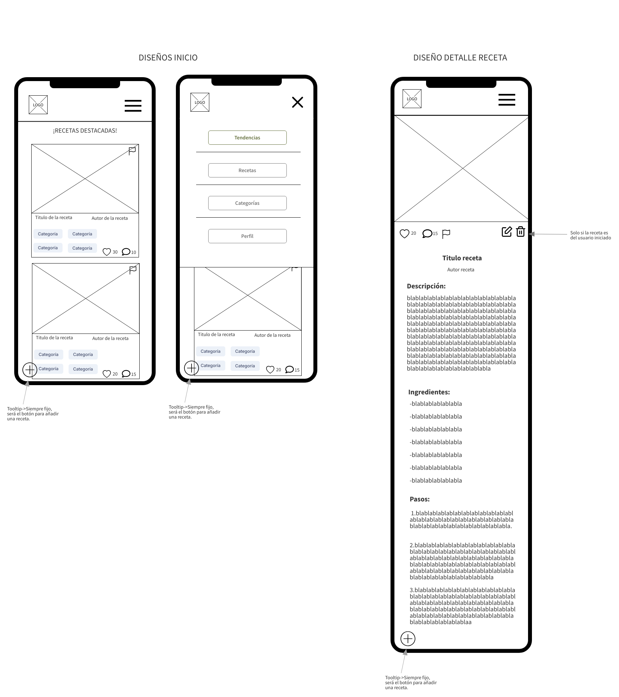
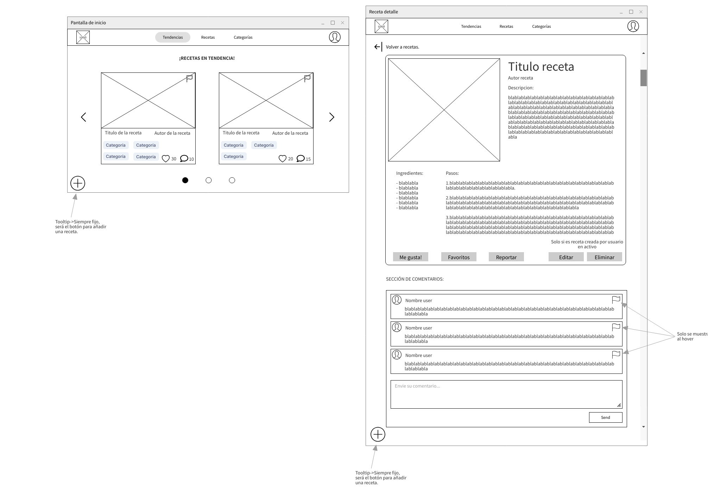
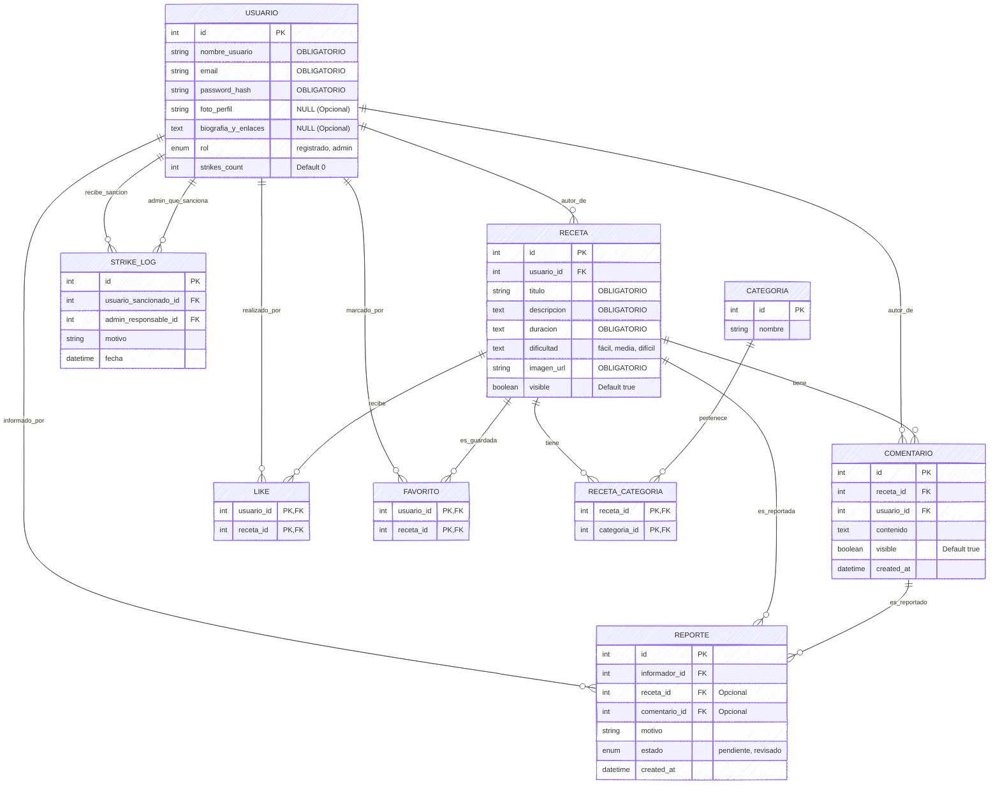

# Deseño

## Esquema (boceto ou wireframe).

A continuación mostranse varias das pantallas principáis do proxecto, tendo en conta que é un boceto e pode sufrir algunha pequena modificación á hora de programar a aplicación:





## Identidade visual

O fondo principal da páxina empregarase nun ton crema suave, que achega sensación de limpeza, amplitude e facilita que os elementos principais destaquen sen cansar a vista. Para as áreas de contido, como receitas e seccións, utilizarase un branco roto que crea unha lixeira diferenciación visual e evita unha aparencia plana.

O color primario será o verde oliva, empregado no logotipo, títulos e elementos destacados. Esta elección está directamente vinculada coa marca, OLEA, nome que fai referencia á familia arbórea das oliveiras, reforzando así a identidade do proxecto e a súa relación co aceite de oliva, un dos ingredientes máis representativos da cociña.

Como cor de acento usarase un ton laranxa terra, reservado para botóns e accións importantes, xa que atrae a atención e guía a interacción do usuario. Por último, o texto principal presentarase nun verde escuro, garantindo boa lectura e mantendo a coherencia cromática do conxunto.

En canto á tipografía, escóllese unha combinación equilibrada entre Lora para títulos e Hind para o corpo de texto. Lora, de estilo serif, achega personalidade, elegancia e un carácter máis editorial aos encabezados, reforzando a identidade visual do proxecto. Pola súa parte, Hind, garante unha lectura clara e fluída nos contidos máis extensos. Esta combinación permite establecer unha xerarquía visual efectiva, mantendo ao mesmo tempo unha experiencia de lectura cómoda e moderna.

A continuación podes ver as devanditas cores e tipografías como se usarán no ficheiro de estilos da aplicación:

```css
:root {
  /* Paleta de Colores */
  --fondo-crema: #fefae0;
  --fondo-bloque: #f8f9fa;
  --color-olea: #606c38;
  --color-acento: #dda15e;
  --color-texto: #283618;
  --color-alerta: #bc6c25;

  /* Tipografías */
  --fuente-titulos: "Lora", serif;
  --fuente-cuerpo: "Hind", sans-serif;
}
```

## Diagrama de Bases de Datos

A continuación móstrase o diagrama da organización da base de datos empregada na nosa app:


